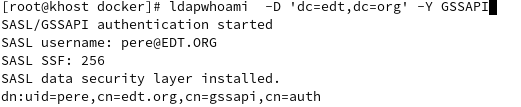
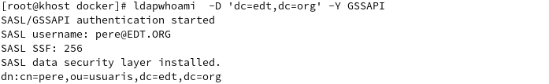

% Proyecto fin de ciclo LdapGssapi
% Daniel Cano
% 2019/05/29

---

## ÍNDICE

* OBJEIVOS

* LDAP

* SIMPLE

* SASL

* MD5/CRAM

* EXTERNAL

* GSSAPI

---

## OBJETIVOS

* Presentar LDAP

* Mostrar algunos de sus metodos de autenticacion

* Dar a conocer SASL

## LDAP

* Son las siglas de **Lightweight Directory Access Protocol** (en español Protocolo Ligero/Simplificado de Acceso a Directorios)
que permite el acceso a un servicio de directorio ordenado y distribuido para buscar diversa información en un entorno de red.
* Un directorio es un conjunto de objetos con atributos organizados en una manera lógica y jerárquica.
* En un árbol de directorio pueden aparecer entradas que representan personas, unidades organizacionales, impresoras o cualquier cosa que representa una o multiples entradas dadas en el árbol.
* Habitualmente, almacena la información de autenticación (usuario y contraseña) y es utilizado para autenticarse 
aunque es posible almacenar otra información como datos de contacto del usuario.
* LDAP tambien  es considerado una base de datos en la cual pueden realizarse consultas.

## SIMPLE

* La autenticación simple consiste en que un cliente (ususario) envie al servidor LDAP (**bind**) el DN completo y la contraseña de texto sin cifrar.
* Este mecanismo no es muy fiable respecto a la seguridad, ya la contraseña se ha enviado en texto plano por la red.

		ldapwhoami -x -D "uid=pere,ou=usuaris,dc=edt,dc=org" -w pere

## SASL

* **Simple Authentication and Security Layer** (capa de seguridad y autenticación simple).
* SASL es un entorno de trabajo para autenticación y autorización en protocolos de Internet. Permite a cualquier protocolo de aplicación que use SASL usar cualquier mecanismo de autenticación soportado por SASL.
* Para utilizarlo en LDAP hay que configurar el slapd del servidor para que pueda comunicarse con los clientes. Hay que tener en cuenta la asignación de identidades de autenticación a los DN de LDAP.

## MD5/CRAM

* MD5/CRAM funciona utilizando secretos almacenados en el directorio o en la propia base de datos de Cyrus SASL.
    * Para usar secretos almacenados en sasldb, se hace mediante **saslpasswd2**:
				
			saslpasswd2 -c "usuario"
	* Para usar los secretos almacenados en el directorio LDAP, necesitamos poner la contraseña sin formato en el atributo **userPassword** y agregar la opcion 
	**password-hash   {CLEARTEXT}**	en el slapd.conf para asegurarse que las contraseñas se almacenen en texto sin formato.
	
* MD5/CRAM se basa en que el cliente y el servidor comparten un "secreto", el cual esta cifrado mediante la contraseña.
* El servidor genera un desafío y el cliente responde cifrando los datos con su contraseña utilizando el algoritmo MD5.
El servidor LDAP luego usa la contraseña almacenada del cliente para determinar si el cliente usó la contraseña correcta.
* Este metodo es más seguro que simplemente enviar la conraseña por red.

## EXTERNAL

* Funciona a partir de la confianza de los certificados cleinte servidor.

* Para admitir la autenticación LDAP utilizando el mecanismo SASL EXTERNO necestitamos usar **TLS** (Transport Layer Security) para proporcionar protecciones de integridad y confidencialidad.

* TLS utiliza certificados para llevar la identidad del servidor y del cliente.

* Antes de crear los certificados tenemos que crear una **CA** (Autoridad certificadora) para poder crear certificados validos y confiables. 

	* Creamos certificado CA autosignado. 
 
			openssl req -new -x509 -nodes -keyout cakey.pem -days 3650 -out cacert.pem
  
	* Certificado servidor
 
		* Generamos la clave
				
				openssl genrsa -out serverkey.ldap.pem
  
		* Generamos solicitud para que la firme la CA
				
				openssl req -new -key serverkey.ldap.pem -out serverreq.ldap.pem
	
		* Firmamos peticion
	
				openssl x509 -CA cacert.pem -CAkey cakey.pem -req -in serverreq.ldap.pem -days 3650 -CAcreateserial -out servercert.ldap.pem
  
## GSSAPI

* Primero de todo tenemos que saber que es **KERBEROS**

* Kerberos es un protocolo de autenticación. Usa **Key Distribution Center, "KDC"** (centro de distribución de claves) el cual consiste en dos partes:

	* Un **Authentication Server, "AS"** (servidor de autenticación)
	
	* Y un **Ticket Granting Server, "TGS"** (servidor emisor de tickets), los cuales sirven para demostrar la identidad de los usuarios.

* Kerberos mantiene una base de datos de claves secretas. Cada cliente o servidor comparte una clave secreta únicamente conocida por él y Kerberos. 
Esta clave sirve para probar la identidad de la entidad.  

* Una vez tenemos el un servidor Kerberos pasamos al servidor LDAP.Aparte de usar SASL ahora necesitamos que se autentique con Kerberos para recibir el "ticket".

	* Necesitamos un fichero (**krb5.conf**) que contiene configuracion del servidor Kerberos, este es el mismo tanto en el servidor LDAP ,en Kerberos y en el cliente. 
	De esta manera ya es capaz de llegar a Kerberos.
	
		**/etc/krb5.conf**		
					
			[libdefaults]
			dns_lookup_realm = false
			ticket_lifetime = 24h
			renew_lifetime = 7d
			forwardable = true
			rdns = false
			default_realm = EDT.ORG
			
			[realms]
			EDT.ORG = {
			kdc = kserver.edt.org
			admin_server = kserver.edt.org
			}
			
			[domain_realm]
			.edt.org = EDT.ORG
			edt.org = EDT.ORG
	
	* Para que pueda recibir el "ticket" hay que importar las claves.
		
			kadmin -p admin -w kadmin -q "ktadd -k /etc/krb5.keytab ldap/ldap.edt.org"
			
	* Y por ultimo modificaremos el fichero de configuracion del servidor LDAP (**slapd.conf**).
	
		Tenemos que configurar para que LDAP reconozca los "principals" (identidad a la que Kerberos puede asignar tickets) como usuarios de LDAP.
		
				authz-policy from
				authz-regexp "^uid=[^.*]+/admin,cn=edt\.org,cn=gssapi,cn=auth" "cn=Manager,dc=edt,dc=org"
				authz-regexp "^uid=admin,cn=edt\.org,cn=gssapi,cn=auth" "cn=Manager,dc=edt,dc=org"
				authz-regexp "^uid=([^.*]+),cn=edt\.org,cn=gssapi,cn=auth" "cn=$1,ou=usuaris,dc=edt,dc=org"
		
		Cuando intentamos utilizar alguna operacion que requiere un ticket con LDAP a traves de los usuarios LDAP, la identidad no sale como estamos acosstrumbrados, por eso utilizamos el paso anterior.
		
		La primera linea habilita *authz-regexp*.
		
		La segunda y tercera transforma todos los "principals" admin (**/admin@EDT.ORG* o *admin@EDT.ORG*) a nuestro
		admin de LDAP (*cn=Manager,dc=edt,dc=org*). 
		
		Y la ultima transforma todas las entradas (**/edt.org*) a usuario LDAP.
		
		* Sin midificar slapd.conf: 
			
			
			
		* Modificando slapd.conf: 
			
		Si queremos limitar las opciones de SASL paraque sea por defecto GSSAPI utilizaremos **sasl-secprops** (se usa para especificar las propiedades de seguridad).
		
			sasl-secprops noanonymous,noplain,noactive
			
		Este debería ser el reino definido en el archivo krb5.conf.

			sasl-realm EDT.ORG
			
		Aqui hay que colocar el nombre del servidor LDAP, es muy importante para la importacion de claves.
		
			sasl-host ldap.edt.org
			
* Ya solo nos queda el cliente. Para ello necesitaremos el fichero **/etc/krb5.conf** que he mencionado anteriormente y modificar el fichero de conficuracion de Ldap cliente (**ldap.conf**).

	* **/etc/openldap/ldap.conf**:
		
			BASE	dc=edt,dc=org
			URI	ldap://ldap.edt.org
			
			TLS_CACERT /etc/openldap/certs/cacert.pem
			TLS_REQCERT     allow
			
		* *BASE*: La base de nuestra base de datos de LDAP.
		* *URI*: El nombre del servidor LDAP (FQDN)
		* *TLS_CACERT*: La ruta donde esta la CA que firmoo los certificados LDAP
		* *TLS_REQCERT*: Especifica que tipo de comprobación se ha de realizar a un certificado de servidor
		* *SASL_MECH*: Aqui poner nuestro mecanismo (GSSAPI), nos ahorraremos de poner -Y en cada sentencia
		* *SASL_REALM*: El Reino SASL que definimos en el archivo slapd.conf
